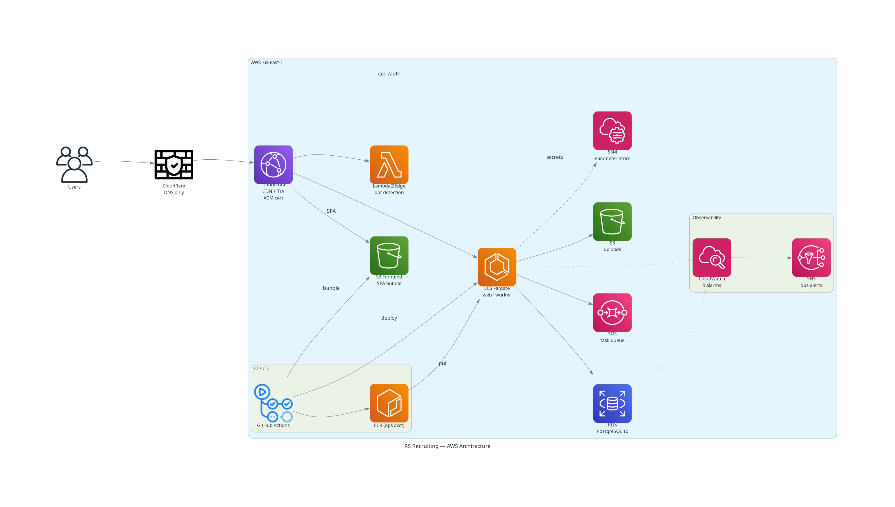
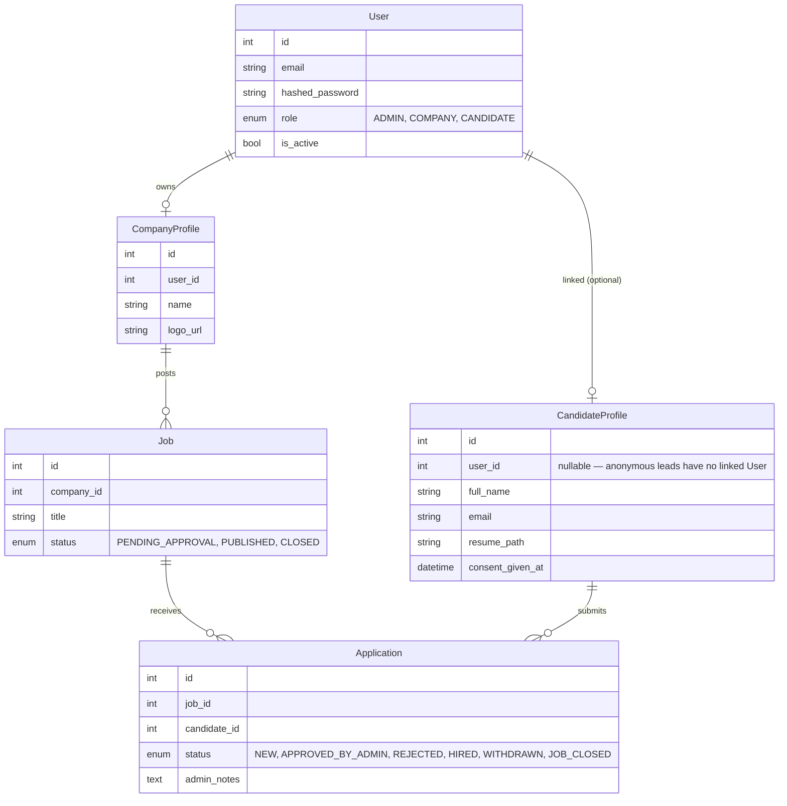

# RS Recruitment

A production recruitment CRM for a boutique agency — the whole pipeline, from company onboarding and job postings through candidate applications to admin-gated match decisions. Hebrew-first, RTL, dark-luxury React on the front; an async FastAPI backend split across three services on AWS Fargate behind it.

**Live:** [rs-recruiting.com](https://rs-recruiting.com)


<p><em>Public site — landing page, job board, and the candidate application flow</em></p>


<p><em>Admin dashboard — live stats across companies, jobs, applications, and candidates, with quick actions</em></p>

---

## What it does

Four actors, one pipeline.

- **Candidates** self-register, verify by email, upload a résumé, apply to jobs, track application status, and export their data (GDPR ZIP) or have it purged.
- **Companies** are invited by an admin, post jobs, and watch applications land per posting.
- **Admins** approve invites and job postings, triage applications through their lifecycle, browse the candidate directory, and see every action they take written to an append-only audit log.
- **The public** browses an SEO-indexed job board — server-prerendered Open Graph pages and JSON-LD `JobPosting` data so a job link unfurls and ranks like a real page, not a blank SPA shell.

Under the hood, a **résumé-matching engine** embeds jobs and résumés (Cohere multilingual, strong on Hebrew) into pgvector and ranks candidate–job fit by cosine similarity — computed off the request path by the background worker.

### Feature map

| Area | Highlights |
|---|---|
| **Public** | Job board + per-job detail pages · résumé upload (PDF/DOCX → S3, magic-byte validated) · GDPR consent captured per submission (timestamp, policy version, IP, UA) · sitemap.xml, robots.txt, OG prerender |
| **Candidate** | Email-verified signup (2h window) · profile + résumé management · application tracking · GDPR export & retention purge · forgot-password flow |
| **Company** | Job posting & management · applications per job |
| **Admin** | Invite → approve → activate onboarding · job approval queue · application triage (New → Approved → Hired / Rejected / Withdrawn) · candidate directory · audit log |
| **Auth** | 10-min JWT access + 7-day HttpOnly refresh cookie · role guards (admin / company / candidate / public) · single-use rotating refresh tokens · 5-strike account lockout (15-min, DB-backed) |

---

## Tech Stack

| Layer | Technologies |
|---|---|
| Frontend | React 19 · TypeScript (strict) · Vite · Tailwind CSS v4 · React Router v7 |
| Backend | FastAPI · SQLModel (SQLAlchemy + Pydantic) async · Alembic · Python 3.12 |
| Database | PostgreSQL 16 · asyncpg (warm pool + pre-ping) · pgvector for match embeddings |
| Background jobs | AWS SQS + a bespoke Python worker service · EventBridge Scheduler (nightly retention purge) |
| Matching | Cohere multilingual embeddings · pgvector cosine similarity |
| Storage / Email | S3 (prod) & local FS (dev) · Resend over SMTP (prod) & Mailpit (dev) — both behind provider factories · 18 transactional HTML templates |
| Auth | PyJWT · bcrypt · HttpOnly refresh cookie · slowapi rate limiting |
| Observability | Sentry (backend + frontend source maps) · Grafana (Loki / Tempo / Mimir) · CloudWatch alarms → SNS |
| Infrastructure | ECS Fargate · RDS · S3 · SQS · ECR · SSM · CloudFront · Cloudflare (DNS only) |
| CI/CD | GitHub Actions — OIDC (no stored keys), change detection, Pytest on real PostgreSQL, continuous delivery to ECS with a manual prod gate |
| Quality gates | Ruff · ESLint · TypeScript strict · 5 custom validators · import-linter · weekly pip-audit |

---

## Architecture



<p><em>Request path: Users → Cloudflare (DNS only) → CloudFront → S3 (frontend SPA) or the ECS Fargate API service via API/auth/health behaviors (Lambda@Edge handles bot detection for OG prerender). Background: SQS → ECS Fargate worker. CI/CD: GitHub Actions → S3 (frontend bundle) + ECR (Docker images, ops account) → ECS deploy. Observability: CloudWatch alarms → SNS ops-alerts; Inspector2 scans ECR on push. All secrets live in SSM Parameter Store as SecureStrings.</em></p>

The backend is a **uv workspace** of three members that deploy as two images:

- **`rs_shared`** (`libs/shared`) — the framework-free domain: models, enums, business services, email templates, and the `core/` infrastructure and provider abstractions. Installed into *both* images.
- **`rs_api`** (`services/api`) — the FastAPI web stack: routers, request middleware, auth dependencies, the slowapi limiter.
- **`rs_worker`** (`services/worker`) — the SQS consumer that runs email, data-export, purge, and matching tasks.

`rs_shared` and `rs_worker` stay web-stack-free; the boundary is enforced by import-linter contracts and a guard test, so a stray `fastapi` import in the domain fails CI rather than shipping.

### Data model



---

## Design decisions

The choices worth explaining — the *why*, not the *what*.

**Three-tier authentication.** Admins, companies, and candidates are all first-class roles. The schema tells authenticated candidates (`user_id` linked) apart from anonymous leads (applications submitted before signup), so a "register and claim" flow reconciles the two without special-casing legacy rows.

**Stateless JWT, short access tokens, no blacklist.** Access tokens live 10 minutes; refresh tokens are single-use and deleted on logout or rotation. The short TTL *is* the post-logout tolerance window, so there's no revocation list to maintain. Replaying a consumed refresh token nukes the whole family. Lockout state rides on the `User` row (`locked_until`).

**Everything external is a provider abstraction.** Storage, email, and embeddings each sit behind an ABC + factory chosen by config. One env var flips storage between local disk and S3, or email between Mailpit and Resend — no code change. Local dev needs zero cloud accounts.

**Work leaves the request path.** Sending mail or computing embeddings inline invites timeouts and provider throttling. Instead, tasks are pushed to SQS and run by the worker; a `defer_after_commit` hook enqueues them *only after* the originating transaction commits, so a rollback can't leave a phantom message. SQS is at-least-once, so every task is idempotent by construction.

**OIDC continuous delivery with change detection.** GitHub Actions authenticates to AWS via OIDC — no stored keys anywhere in the repo. A `detect-changes` job skips work a diff doesn't touch (a docs-only PR never builds Docker). Each commit that lands on `main` green is built once (tagged by SHA, pushed to the ops-account ECR) and promoted to prod behind a manual approval (a `production` Environment reviewer). Prod runs a gated migration first, then rolls with the deployment circuit breaker armed.

**Custom validators catch what linters miss.** Beyond Ruff and tsc, five CI scripts enforce architecture: SOC import boundaries (domain can't import FastAPI), blocking-I/O detection in async code (`open()`, `requests.*`, `time.sleep()`), type-hint coverage on public functions, 1:1 test-file mapping, and file-size limits.

**SEO prerendering for a SPA.** A client-rendered React page is invisible to a job-specific crawler. The backend serves real HTML snapshots — full OG meta, canonical URLs, JSON-LD `JobPosting` (title, salary, location, dates) — plus a dynamic sitemap with `lastmod` from `updated_at`. Bots get HTML; humans get the SPA.

**Hebrew-only RTL.** The entire UI is Hebrew with `<html dir="rtl">` forced globally. Strings live in per-namespace JSON under `locales/he/` (14 files); raw backend error strings are never shown — they map to Hebrew keys.

---

## Testing

88 test files running in parallel via `pytest-xdist` — each worker gets a dedicated database. No test touches the network; SQS, S3, and email are faked in `conftest.py`.

```
tests/
├── models/                  # ORM model validation
├── services/                # Business logic (auth, admin, company, public, candidate)
├── api/                     # Endpoint tests, mirroring the routers
│   └── infrastructure/      # web plumbing: deps, error mapping, limiter, middleware
├── templates/               # Email template rendering
└── core/
    ├── services/            # email, storage, file validation, embeddings, cv extraction
    └── infrastructure/      # DB, config, security, transactions, request context
```

Notable coverage: the full auth lifecycle (invite → registration → approval → activation → login → lockout → logout), candidate signup/activation, SEO output (sitemap, JSON-LD, OG prerender), SQS enqueue/consume for every task, the storage abstraction, and transaction rollback guarantees.

```bash
uv run pytest -n auto        # full suite, parallel
scripts/test_fast.sh         # same, no coverage — fast dev loop
```

---

## Local development

**Prerequisites:** Python 3.12+ · [uv](https://github.com/astral-sh/uv) · Docker + Compose · Node 22+

The schema is built locally from `SQLModel.metadata.create_all`, **not** by running migrations — the Alembic chain is designed to run on top of an existing production schema, so don't point `alembic upgrade` at a fresh database.

```bash
# 1. Clone and install the whole workspace (all three members, editable)
git clone https://github.com/lahavrud/rs-recruiting.git
cd rs-recruiting
uv sync

# 2. Start backing services — Postgres + Mailpit (SMTP) + LocalStack
make services

# 3. Run the API (tasks run inline while SQS_QUEUE_URL is unset)
uv run uvicorn rs_api.main:app --reload

# 4. Frontend, in a second terminal
cd frontend && npm install && npm run dev
```

The frontend proxies `/api/*` to `localhost:8000`. Outbound mail lands in [Mailpit](http://localhost:8025) — no provider account needed. For the full containerized split (API + worker images, real queue via LocalStack), use `make up` instead of `make services`.

### Environment

```bash
# The one thing you must set:
export JWT_SECRET_KEY=$(python3 -c "import secrets; print(secrets.token_urlsafe(32))")
```

Production-only vars (AWS, Sentry DSN, Resend SMTP, S3 bucket) aren't needed for local work — the compose defaults cover everything else.

### Before you commit

```bash
uv run ruff check . && uv run ruff format --check .      # backend
cd frontend && npx tsc --noEmit && npm run lint          # frontend
make check                                               # full CI-parity gate
```

---

## Project structure

```
rs-recruiting/
├── libs/shared/rs_shared/     # framework-free domain (installed into both images)
│   ├── models.py  enums.py  schemas/  templates/  assets/
│   ├── services/              # business logic, one package per actor:
│   │                          #   auth/ admin/ company/ candidate/ public/ utils/
│   └── core/
│       ├── tasks.py  task_contract.py  matching.py   # SQS task queue + résumé matching
│       ├── infrastructure/    # config, database, security, pagination, telemetry
│       └── services/          # provider ABCs: email, storage, embeddings, cv_extraction
├── services/api/rs_api/       # FastAPI service
│   ├── main.py
│   ├── api/                   # routers: auth/ admin/ company/ candidate/ public/ seo/
│   └── infrastructure/        # web-only: auth deps, error→HTTP mapping, limiter, middleware
├── services/worker/rs_worker/ # SQS consumer (console script: rs-worker)
├── frontend/src/
│   ├── pages/                 # public/ admin/ company/ candidate/ + auth pages
│   ├── components/            # guards/ layout/ ui/ (~35 shared primitives)
│   ├── hooks/  services/  types/  locales/he/
├── tests/                     # 88 test files, xdist-parallel
├── scripts/                   # 5 CI validators + seed/backfill tooling
├── alembic/                   # migrations (prod-only; local uses create_all)
└── .github/workflows/
    ├── ci.yml                 # lint · test · docker-build (change-aware)
    ├── deliver.yml            # build by SHA → staging → manual approval → prod → tag
    ├── _deploy.yml            # reusable per-env ECS deploy (migrate → roll → frontend)
    ├── rollback.yml           # re-point an ECS service to a prior task-def revision
    └── security-audit.yml     # weekly pip-audit
```
